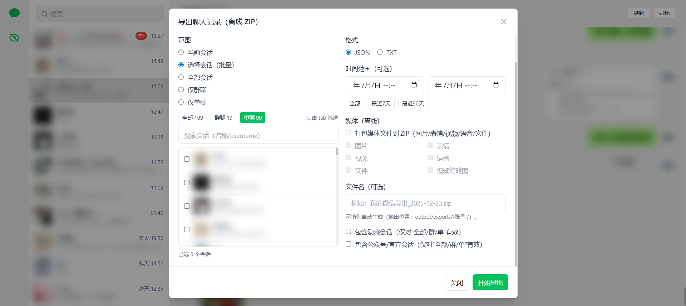

<p align="center">
    
</p>

<div align="center">
    <h1>WeChatDataAnalysis - 微信数据库解密与分析工具</h1>
    <p>一个专门用于微信4.x版本数据库解密的工具（支持聊天记录实时更新）</p>
    <p><b>特别致谢</b>：<a href="https://github.com/ycccccccy/echotrace">echotrace</a>（本项目大量功能参考其实现，提供了重要技术支持）</p>
    
    
    
    
    
    
    
    
</div>

## 界面预览

<table>
  <tr>
    <td align="center"><b>首页</b></td>
    <td align="center"><b>检测页面</b></td>
  </tr>
  <tr>
    <td></td>
    <td></td>
  </tr>
  <tr>
    <td align="center"><b>解密页面</b></td>
    <td align="center"><b>图片密钥（填写）</b></td>
  </tr>
  <tr>
    <td></td>
    <td></td>
  </tr>
  <tr>
    <td align="center"><b>图片解密页面</b></td>
    <td align="center"><b>解密成功页面</b></td>
  </tr>
  <tr>
    <td></td>
    <td></td>
  </tr>
  <tr>
    <td align="center" colspan="2"><b>聊天记录页面</b></td>
  </tr>
  <tr>
    <td colspan="2" align="center"></td>
  </tr>
  <tr>
    <td align="center" colspan="2"><b>聊天记录搜索</b></td>
  </tr>
  <tr>
    <td colspan="2" align="center"></td>
  </tr>
  <tr>
    <td align="center" colspan="2"><b>聊天记录导出</b></td>
  </tr>
  <tr>
    <td colspan="2" align="center"></td>
  </tr>
</table>

## 功能特性

### 已实现功能

- **数据库解密**: 支持微信4.x版本数据库文件的解密
- **多账户检测**: 自动检测并处理多个微信账户的数据库文件
- **API接口**: 提供RESTful API接口进行数据库解密操作
- **Web界面**: 提供现代化的Web操作界面
- **聊天记录查看**: 支持查看解密后的聊天记录、消息搜索与离线导出
- **实时更新（SSE）**: 支持开启实时模式，监听 `db_storage` 变更，增量同步新消息并自动刷新会话/消息列表
- **聊天图片展示**: 支持部分版本图片消息无MD5时通过 file_id 兜底定位本地资源

### 开发计划

- **数据分析**: 对解密后的数据进行深度分析
- **数据可视化**: 提供图表、统计报告等可视化展示
- **聊天记录分析**: 消息频率、活跃时间、关键词分析等
- **聊天记录优化**: 高级筛选、统计报表等功能

> **项目进展**: 查看 [GitHub项目面板](https://github.com/orgs/LifeArchiveProject/projects/1/views/1) 了解当前开发状态和后续功能规划

## 快速开始

### 1. 克隆项目

```bash
git clone https://github.com/2977094657/WeChatDataAnalysis
```

### 2. 安装后端依赖

```bash
# 使用uv (推荐)
uv sync
```

### 3. 安装前端依赖

```bash
cd frontend
npm install
```

### 4. 启动服务

#### 启动后端API服务
```bash
# 在项目根目录
uv run main.py
```

#### 启动前端开发服务器
```bash
# 在frontend目录
cd frontend
npm run dev
```

### 5. 访问应用

- 前端界面: http://localhost:3000
- API服务: http://localhost:8000
- API文档: http://localhost:8000/docs

## 使用指南

### 获取解密密钥

在使用本工具之前，您需要先获取微信数据库的解密密钥。推荐使用以下工具：

**wx_key** (推荐)
   - 项目地址: https://github.com/ycccccccy/wx_key
   - 支持获取微信 4.x 数据库密钥

## 安全说明

**重要提醒**:

1. **仅限个人使用**: 此工具仅用于解密您自己的微信数据
2. **密钥安全**: 请妥善保管您的解密密钥，不要泄露给他人
3. **数据隐私**: 解密后的数据包含个人隐私信息，请谨慎处理
4. **合法使用**: 请遵守相关法律法规，不得用于非法目的

## 致谢

本项目的开发过程中参考了以下优秀的开源项目和资源：

### 主要参考项目

1. **[echotrace](https://github.com/ycccccccy/echotrace)** - 微信数据解析/取证工具
   - 本项目大量功能参考并复用其实现思路，提供了重要技术支持

2. **[wx_key](https://github.com/ycccccccy/wx_key)** - 微信数据库与图片密钥提取工具
   - 支持获取微信 4.x 数据库密钥与缓存图片密钥
   - 本项目推荐使用此工具获取密钥

3. **[wechat-dump-rs](https://github.com/0xlane/wechat-dump-rs)** - Rust实现的微信数据库解密工具
   - 提供了SQLCipher 4.0解密的正确实现参考
   - 本项目的HMAC验证和页面处理逻辑基于此项目的实现

4. **[oh-my-wechat](https://github.com/chclt/oh-my-wechat)** - 微信聊天记录查看工具
   - 提供了优秀的聊天记录界面设计参考
   - 本项目的聊天界面风格参考了此项目的实现

5. **[vue3-wechat-tool](https://github.com/Ele-Cat/vue3-wechat-tool)** - 微信聊天记录工具（Vue3）
   - 提供了聊天记录展示与交互的实现参考

## Star History

[](https://www.star-history.com/#LifeArchiveProject/WeChatDataAnalysis&Date)

## 贡献

欢迎提交Issue和Pull Request来改进这个项目。

## 许可证

本项目仅供学习和个人使用。请遵守相关法律法规。

---

**免责声明**: 本工具仅供学习研究使用，使用者需自行承担使用风险。开发者不对因使用本工具造成的任何损失负责。
