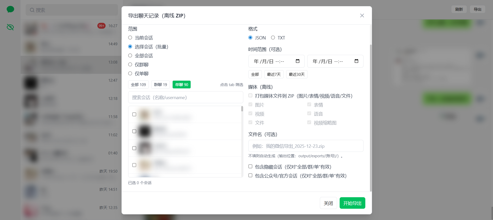

<p align="center">
    
</p>

<div align="center">
    <h1>WeChatDataAnalysis - 微信数据库解密与分析工具</h1>
    <p>微信4.x数据解密并生成年度总结，高仿微信，支持实时更新，导出聊天记录，朋友圈等大量便捷功能</p>
    <p><b>特别致谢</b>：<a href="https://github.com/H3CoF6">H3CoF6</a>（密钥与朋友圈等核心内容的技术支持）、<a href="https://github.com/ycccccccy/echotrace">echotrace</a>、<a href="https://github.com/hicccc77/WeFlow">WeFlow</a>（本项目大量功能参考其实现）</p>
    <p>如需定制功能，请联系 QQ：2977094657。</p>
    
    
    
    
    <a href="https://qm.qq.com/q/VQEQ7PcGkk"></a>
    
    
    
    <p>如果你需要 QQ 侧的数据解密、分析或年度总结类工具，欢迎体验 <a href="https://github.com/H3CoF6/WeQ">H3CoF6/WeQ</a>；WeQ 作者也是本项目开发成员之一</p>
</div>

## 年度总结

<table>
  <tr>
    <td align="center" colspan="2"></td>
  </tr>
  <tr>
    <td></td>
    <td></td>
  </tr>
  <tr>
    <td></td>
    <td></td>
  </tr>
  <tr>
    <td></td>
    <td></td>
  </tr>
  <tr>
    <td></td>
    <td></td>
  </tr>
</table>

## 界面预览

<table>
  <tr>
    <td align="center" colspan="2"><b>聊天记录页面</b>（支持多种消息类型展示，样式尽可能与微信保持一致）</td>
  </tr>
  <tr>
    <td colspan="2" align="center"></td>
  </tr>
  <tr>
    <td align="center" colspan="2"><b>修改消息</b>（本地修改，支持恢复）</td>
  </tr>
  <tr>
    <td colspan="2" align="center"></td>
  </tr>
  <tr>
    <td align="center" colspan="2"><b>实时消息同步</b>（点击侧边栏闪电图标后，消息会自动刷新）</td>
  </tr>
  <tr>
    <td colspan="2" align="center"></td>
  </tr>
  <tr>
    <td align="center" colspan="2"><b>设置面板</b>（桌面行为、启动偏好、更新、朋友圈缓存策略）</td>
  </tr>
  <tr>
    <td colspan="2" align="center"></td>
  </tr>
  <tr>
    <td align="center" colspan="2"><b>朋友圈</b>（支持查看用户之前朋友圈的背景图及时间；本地查看过的朋友圈即使后续不可见也可以查看）</td>
  </tr>
  <tr>
    <td colspan="2" align="center"></td>
  </tr>
  <tr>
    <td align="center" colspan="2"><b>聊天记录搜索</b></td>
  </tr>
  <tr>
    <td colspan="2" align="center"></td>
  </tr>
  <tr>
    <td align="center" colspan="2"><b>聊天记录导出</b></td>
  </tr>
  <tr>
    <td colspan="2" align="center"></td>
  </tr>
  <tr>
    <td align="center" colspan="2"><b>联系人导出</b></td>
  </tr>
  <tr>
    <td colspan="2" align="center"></td>
  </tr>
</table>

## 加入群聊

也欢迎加入下方 QQ 群一起讨论。

<p align="center">
    <a href="https://qm.qq.com/q/VQEQ7PcGkk">
        
    </a>
</p>

## 快速开始

### 1. 下载并安装 EXE（Windows，推荐）

1. 打开 Release 页面（最新版）：https://github.com/LifeArchiveProject/WeChatDataAnalysis/releases/latest
2. 下载 `WeChatDataAnalysis.Setup.<version>.exe` 并运行安装
3. 安装完成后启动 `WeChatDataAnalysis`

> 如果 Windows 弹出“未知发布者/更多信息”等提示，请确认下载来源为本仓库 Release 后再选择“仍要运行”。

### 2. 从源码运行（开发者/高级用户）

#### 2.1 克隆项目

```bash
git clone https://github.com/LifeArchiveProject/WeChatDataAnalysis.git
cd WeChatDataAnalysis
```

#### 2.2 安装后端依赖

```bash
# 使用uv (推荐)
uv sync
```

#### 2.3 安装前端依赖

```bash
cd frontend
npm install
```

#### 2.4 启动服务

#### 启动后端API服务
```bash
# 在项目根目录
uv run main.py
```

#### 启动前端开发服务器
```bash
# 在frontend目录
cd frontend
npm run dev
```

#### 2.5 访问应用

- 前端界面: http://localhost:3000
- API服务(默认): http://localhost:10392 （可通过环境变量 WECHAT_TOOL_PORT 修改）
- API文档(默认): http://localhost:10392/docs

## MCP 服务

设置页中的“AI 接入提示词”会包含 endpoint 和 Bearer token，可直接复制给客户端作为接入指令。

## 打包为 EXE（Windows 桌面端）

本项目提供基于 Electron 的桌面端安装包（NSIS `Setup.exe`）。

```bash
# 1) 安装桌面端依赖
cd desktop
npm install

# 2) 打包（会自动：nuxt generate -> 拷贝静态资源 -> PyInstaller 打包后端 -> electron-builder 生成安装包）
npm run dist
```

输出位置：`desktop/dist/WeChatDataAnalysis Setup <version>.exe`

## 安全说明

**重要提醒**:

1. **仅限个人使用**: 此工具仅用于解密您自己的微信数据
2. **密钥安全**: 请妥善保管您的解密密钥，不要泄露给他人
3. **数据隐私**: 解密后的数据包含个人隐私信息，请谨慎处理
4. **合法使用**: 请遵守相关法律法规，不得用于非法目的

## 致谢

1. **[echotrace](https://github.com/ycccccccy/echotrace)**
2. **[WeFlow](https://github.com/hicccc77/WeFlow)**
3. **[wx_key](https://github.com/ycccccccy/wx_key)** 
4. **[wechat-dump-rs](https://github.com/0xlane/wechat-dump-rs)** 
5. **[oh-my-wechat](https://github.com/chclt/oh-my-wechat)** 
6. **[vue3-wechat-tool](https://github.com/Ele-Cat/vue3-wechat-tool)** 
7. **[wx-dat](https://github.com/waaaaashi/wx-dat)**
8. **[Ritsu](https://xhslink.com/m/7YJUsd1sgyF)**
9. **[recarto404](https://github.com/recarto404)**

## Star History

[](https://www.star-history.com/#LifeArchiveProject/WeChatDataAnalysis&Date)

## 贡献

欢迎提交Issue和Pull Request来改进这个项目。

---

**免责声明**: 本工具仅供学习研究使用，使用者需自行承担使用风险。开发者不对因使用本工具造成的任何损失负责。

